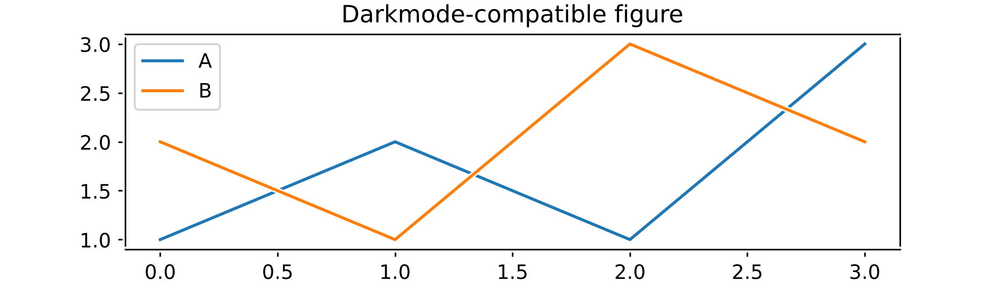

+++
title = "Matplotlibでダークモード対応の図をいい感じに作る"
description = "表示要素に白色のボーダーを追加することで対応します"
date = 2021-08-04T01:12:01+09:00
tags = ["Python", "Matplotlib"]
categories = ["Tech"]
image = "cover.jpg"
+++

## TL;DR

Matplotlibの表示要素に白色のボーダーを追加することで、同一の画像ファイルでライトモード（白背景）とダークモード（黒背景）の両方で見やすい表示となる作図方法をまとめました。
以下の例のように、図の背景を透明にしても線やテキストが黒背景に埋もれず、そこそこ見やすい形で両立できるようになります。



## Path effects

表示要素（artists）にボーダーを追加するにはpath effects（`matplotlib.patheffects`）を使用します。
名前から分かるように、ボーダーを追加できるのはテキストやラインプロットなど線（パス）を持つ要素のみとなります。
今回の場合、`withStroke()`でボーダーの線の色と線幅を設定したpath effectオブジェクトを作成します。

```python
import matplotlib as plt
from matplotlib.patheffects import withStroke


border = withStroke(linewidth=3, foreground="white")
```

## Examples

ボーダーを追加するには、作成したpath effectオブジェクトを（1）rcParamsでグローバルに設定するか、（2）プロット関連の関数やメソッドが持つ`path_effect`オプションで個別に設定するか、（3）表示要素）が持つ`set_path_effects()`メソッドで個別に設定します。
以下では（1）の例を紹介します。

```python
with plt.rc_context({"path.effects": [border]}):
    plt.plot([1, 2, 1, 3], label="A")
    plt.plot([2, 1, 3, 2], label="B")
    plt.title("Darkmode-compatible figure")
    plt.legend()
```

`rc_context()`を使うと、withブロックに書かれた要素のみにボーダーを適用することができます。
ここで、rcParamsの`"path.effects"`は複数の設定を受け取るため、`[border]`のように配列で渡すことに注意してください。

上の例では図（画像）の外周にもボーダーが追加されてしまうため若干見づらいかもしれません。
少し複雑になりますが、以下のように書くことで外周のボーダーを消すことができます。

```python
with plt.rc_context({"path.effects": [border]}):
    fig, ax = plt.subplots()
    ax.plot([1, 2, 1, 3], label="A")
    ax.plot([2, 1, 3, 2], label="B")
    ax.set_title("Darkmode-compatible figure")
    ax.legend()

fig.patch.set_path_effects([])
```

最後の行は（3）を使って、空のpath effectsを再設定しています。


## References

- [Path effects guide — Matplotlib documentation](https://matplotlib.org/stable/tutorials/advanced/patheffects_guide.html)
- [matplotlib.patheffects — Matplotlib documentation](https://matplotlib.org/stable/api/patheffects_api.html#matplotlib.patheffects.withStroke)
